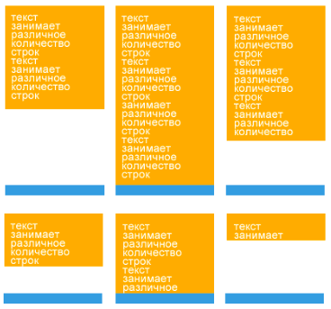

# Задание 4
---
> Сверстайте страницу, содержащую произвольное количество блоков. Блоки должны занимать все возможное пространство страницы. При этом блоки имеют заданную одинаковую ширину, а высота каждого из них определяется его содержимым. В нижней части каждого блока находится синий элемент 
(как на изображении ниже).

> 

---

